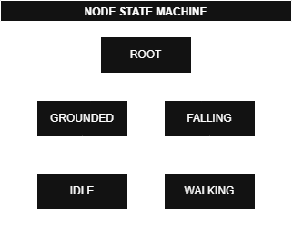

# Node State Machine
This is an implementation targeted for unity, but it can be adapted to any language to be incredibly simple. But very powerful because is event based transitions, that means will not check every frame the transitions conditions and it solves a problem of traditional hierarchical state machines, where if the same state is shared between several other states, for example the idle state, it can belong to grounded and falling and then it would be duplicated n times in all states that have idle. In this system you can define idle once and just pass it as the current state of any state, but keeping the hierarchical structure defined, but not rigid and restricted. Below is a diagram that demonstrates the relationship between the nodes in the example:



And below is an example of usage to build a character controller:

```csharp

using System;
using UnityEngine;

public class PlayerController : MonoBehaviour {
    public event Action walkTrigger;
    public event Action idleTrigger;
    public event Action groundedTrigger;
    public event Action fallingTrigger;
    Node rootNode;
    
    public void Awake() {
        Node walkNode = new Node("walkNode");
        Node idleNode = new Node("idleNode");
        Node groundedNode = new Node("groundedNode", idleNode);
        Node fallingNode = new Node("groundedNode", idleNode);
        rootNode = new Node("rootNode", groundedNode);

        walkTrigger += groundedNode.AddSubNodeTransition(walkNode);
        idleTrigger += groundedNode.AddSubNodeTransition(idleNode);

        groundedTrigger += rootNode.AddSubNodeTransition(fallingNode);
        fallingTrigger += rootNode.AddSubNodeTransition(groundedNode);

        walkNode.OnEnter += () => {
            Debug.Log("Entered on walkNode!");
        };
        fallingNode.OnUpdate += () => {
            Debug.Log("Falling node updating!");
        };
        idleNode.OnExit += () => {
            Debug.Log("Idle node exiting!");
        };
    }

    private void Update() {
        rootNode.Update();

        if (Input.GetKeyDown(KeyCode.W)) {
            walkTrigger?.Invoke();
        }

        if (Input.GetKeyDown(KeyCode.S)) {
            idleTrigger?.Invoke();
        }

        if (Input.GetKeyDown(KeyCode.Space)) {
            fallingTrigger?.Invoke();
        }

        if (Input.GetKeyDown(KeyCode.LeftControl)) {
            groundedTrigger?.Invoke();
        }
        Debug.Log("Current path: " + rootNode.GetNodePath());
    }
}


```

In this example, as in the diagram, there is a subnodes grounded or falling that can be the subnodes of root, and the idle and walking nodes can be subnodes of grounded and falling. The customization of the actions performed by the nodes is through the OnEnter, OnUpdate and OnExit actions of each node, you can add as many actions you want to events, that you be triggered in the subscribed order. The transitions between nodes is defined in the parent node which indicates which are the possible subnodes for it and which is the trigger that will trigger the change to that subnode passed in AddSubNodeTransition method.